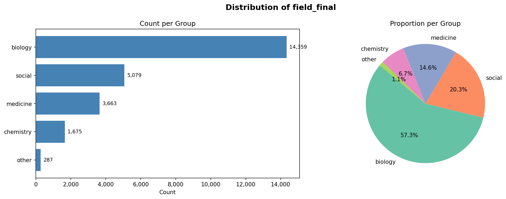

# Analysis

Exploratory data analysis and statistics that accompany the manuscript. These
notebooks read the same `train.csv` used by the rest of the pipeline (see
[`../data/README.md`](../data/README.md) for how to obtain it).

| Notebook | Purpose |
|---|---|
| `regression_analysis.ipynb` | Regression models relating researcher seniority (citations, academic age, publication count) to the choice to pursue an idea and to its rated novelty/feasibility/probability. |
| `field_distribution.ipynb` | Summary and visualization of how the dataset is distributed across scientific fields (`field_final`). Produces `field_final_distribution.png`. |

